# 🗺️ Roadmap Baru Dewan Bengawan — LIDM ITDP 2026 (Berdasarkan Peran & Fase)

Ini adalah rencana kerja komprehensif untuk tim **Dewan Bengawan** pada divisi Inovasi Teknologi Digital Pendidikan (ITDP) LIDM 2026. Roadmap ini disusun berdasarkan peran tim baru dan memisahkan alur kerja secara tegas menjadi **Fase Proposal (s.d. 50% MVP)** dan **Fase Finalisasi (MVP 100% s.d. Tahap Final)**.

---

## 👥 Matriks Peran & Output Utama

| Workstream | Primary Owner | Sekunder | Output Utama |
|---|---|---|---|
| **A. Product Development** | **Fajari (Ketua)** | Alvin | Codebase Unity, build stabil, MVP fungsional |
| **B. Validation & Research** | **Syukri** | Hamdi | Rubrik berpikir spasial-kritis, instrumen, data pilot |
| **C. External Relations** | **Hamdi** | Fajari | Kemitraan sekolah, MGMP, guru pendamping |
| **D. Content & Documentation** | **Syukri** | Fajari | Proposal LIDM, Laporan Akhir, Artikel Jurnal Sinta |
| **E. Legal & Compliance** | **Hamdi** | Dosbing | Pendaftaran HKI, surat pernyataan, audit lisensi |
| **F. MarComm & Identity** | **Alvin** | Fajari | Aset hero 3D, video (proposal & final), Instagram, deck |

---

## 📅 Ringkasan Timeline Fase

| Fase / Kelompok | Minggu | Headline Objective | Quality Gate Lulus |
|---|---|---|---|
| **FASE PROPOSAL (s.d. 50% MVP)** | | | |
| * Fase 1: Foundation Lock | 1–2 | Setup infrastruktur eksternal & draf awal | 2 SMA commit, HKI didaftar, MGMP terhubung |
| * Fase 2: Proposal Sprint | 3–4 | Submit proposal LIDM & video pengembangan | PDF terkirim, video ≥50% fungsional terupload |
| **FASE FINALISASI (MVP 100% & Uji)** | | | |
| * Fase 3: MVP Production | 5–12 | Build MVP 100% fungsional + aset hero | Demo end-to-end tanpa bug kritis |
| * Fase 4: Validation & Iteration | 9–14 | Pilot 2 sekolah + iterasi terdokumentasi | Data pre-post terkumpul, rubrik tervalidasi |
| * Fase 5: Final Polish & Submission | 14–18 | Submit laporan akhir + artikel + HKI | Semua deliverable siap, latihan presentasi |
| * Fase 6: Final Stage Prep | 18+ | Kesiapan mental & teknis di venue final | Simulasi tanya jawab & redundancy check |

---
---

# 📑 BAGIAN I & II: KANBAN BOARD PER ANGGOTA TIM

Roadmap ini dialihkan ke format **Kanban Board Mandiri** per anggota tim dengan pembagian peran yang diperbarui:
* **Fajari (Ketua)**: Bertanggung jawab atas **External Relations** & **Legal & Compliance**.
* **Alvin**: Bertanggung jawab atas **Product Development (Coding & Technical)**.
* **Hamdi**: Bertanggung jawab atas **MarComm & Identity**.
* **Syukri**: Tetap bertanggung jawab atas **Validation & Research** & **Content & Documentation**.

## 📊 Visual Kanban Board per Anggota

```mermaid
flowchart TD
    %% Styling
    classDef todoStyle fill:#f9f9f9,stroke:#bbb,stroke-width:1px,color:#333;
    classDef ipStyle fill:#fff9e6,stroke:#ffcc00,stroke-width:1.5px,color:#333;
    classDef doneStyle fill:#e6f9f2,stroke:#00cc88,stroke-width:1.5px,color:#333;

    subgraph FAJARI ["👤 FAJARI (Ketua)"]
        direction LR
        subgraph F_TD ["📋 TO DO"]
            FT1["Kemitraan 4 SMA & MGMP (M1-4)"]
            FT2["Registrasi HKI & Surat Karya (M1-4)"]
            FT3["Licensing Audit (M1-2)"]
            FT4["Pilot Logistics (M7-10)"]
            FT5["HKI Certification (M5-16)"]
        end
        subgraph F_IP ["🚧 IN PROGRESS"]
            FIP["-"]
        end
        subgraph F_DN ["✅ DONE"]
            FDN["-"]
        end
    end

    subgraph ALVIN ["👤 ALVIN"]
        direction LR
        subgraph A_TD ["📋 TO DO"]
            AT1["Setup CI/CD (M1-2)"]
            AT2["MVP Scope-lock (M1-2)"]
            AT3["Stress Test (M3-4)"]
            AT4["4 Policy Cards (M7-8)"]
            AT5["Reputation Axis (M9-10)"]
            AT6["Deck Expansion (M9-11)"]
            AT7["End Screen (M11-12)"]
            AT8["Game Fix v2 & v3 (M12-14)"]
            AT9["Low-end Test (M14)"]
            AT10["Demo Prep (M15-18)"]
        end
        subgraph A_IP ["🚧 IN PROGRESS"]
            AIP1["Budget System (M3-4)"]
            AIP2["4-Cycle Game Loop (M3-4)"]
        end
        subgraph A_DN ["✅ DONE"]
            ADN1["Codebase Refactor (M1-2)"]
            ADN2["Prototype Polish (M3-4)"]
            ADN3["Critical Bug-Fixes (M3-4)"]
            ADN4["5-Zone Painting (M5-8)"]
            ADN5["CA Water Job+Burst (M5-8)"]
        end
    end

    subgraph SYUKRI ["👤 SYUKRI"]
        direction LR
        subgraph S_TD ["📋 TO DO"]
            ST1["Rubrik Spasial v1 & v2 (M1-4)"]
            ST2["Validator Geografi (M1-2)"]
            ST3["Draft Pre-Post Test (M1-4)"]
            ST4["Proposal Draft & Kutipan (M1-4)"]
            ST5["Diagram & Anggaran (M3-4)"]
            ST6["Rubrik Spasial v3 (M5-6)"]
            ST7["RPP Geografi (M7-8)"]
            ST8["Pilot Test 1 & 2 (M11-13)"]
            ST9["Artikel Jurnal Sinta (M6-15)"]
            ST10["Laporan Akhir (M14-18)"]
        end
        subgraph S_IP ["🚧 IN PROGRESS"]
            SIP["-"]
        end
        subgraph S_DN ["✅ DONE"]
            SDN["-"]
        end
    end

    subgraph HAMDI ["👤 HAMDI"]
        direction LR
        subgraph H_TD ["📋 TO DO"]
            HT1["Branding Instagram (M1-2)"]
            HT2["Visual Identity Guide (M1-2)"]
            HT3["Video Proposal (M3-4)"]
            HT4["YouTube Upload (M4)"]
            HT5["Social Media BTS (M3-4)"]
            HT6["5 3D Hero Assets (M5-8)"]
            HT7["Weekly DevLogs (M5-12)"]
            HT8["Pilot Footage & Video (M11-16)"]
            HT9["Visual Deck (M15-17)"]
        end
        subgraph H_IP ["🚧 IN PROGRESS"]
            HIP["-"]
        end
        subgraph H_DN ["✅ DONE"]
            HDN["-"]
        end
    end

    subgraph DOSBING ["👤 DOSBING"]
        direction LR
        subgraph D_TD ["📋 TO DO"]
            DT1["HKI Sentra (M1-2)"]
            DT2["Proposal & Report Review (M4-16)"]
            DT3["Presentation Rehearsal (M16-18)"]
        end
        subgraph D_IP ["🚧 IN PROGRESS"]
            DIP["-"]
        end
        subgraph D_DN ["✅ DONE"]
            DDN["-"]
        end
    end

    %% Styles
    class FT1,FT2,FT3,FT4,FT5,AT1,AT2,AT3,AT4,AT5,AT6,AT7,AT8,AT9,AT10,ST1,ST2,ST3,ST4,ST5,ST6,ST7,ST8,ST9,ST10,HT1,HT2,HT3,HT4,HT5,HT6,HT7,HT8,HT9,DT1,DT2,DT3 todoStyle;
    class AIP1,AIP2,FIP,SIP,HIP,DIP ipStyle;
    class ADN1,ADN2,ADN3,ADN4,ADN5,FDN,SDN,HDN,DDN doneStyle;
```

---

## 👤 FAJARI (Ketua)
*   **Peran Utama**: External Relations (Sekolah, MGMP, Dosbing), Legal & Compliance (HKI, Surat, Disclosure)

### 📋 1. TO DO (Belum Mulai)
*   **Fase Proposal (Minggu 1-4)**:
    - [ ] **[Ext. Relations]** Kirim email resmi ke minimal 4 SMA target mitra (Minggu 1-2).
    - [ ] **[Ext. Relations]** Hubungi sekretariat MGMP Geografi kota/provinsi untuk koordinasi (Minggu 1-2).
    - [ ] **[Ext. Relations]** Kunci komitmen dari minimal 2 SMA sebagai lokasi pilot test (Minggu 3-4).
    - [ ] **[Ext. Relations]** Minta surat dukungan tertulis dari MGMP Geografi atau minimal 1 guru senior (Minggu 3-4).
    - [ ] **[Legal]** Ajukan pendaftaran HKI Program Komputer Dewan Bengawan ke sentra HKI kampus (Minggu 1-2).
    - [ ] **[Legal]** Audit lisensi aset eksternal (Kenney CC0, SFX/audio) untuk diisikan ke form disclosure (Minggu 1-2).
    - [ ] **[Legal]** Siapkan dokumen fisik bermaterai 10.000 untuk Surat Pernyataan Keterangan Karya (Minggu 3-4).
    - [ ] **[Validation]** Bantu Syukri merumuskan skenario penugasan instrumen berpikir spasial-kritis (Minggu 2-3).
    - [ ] **[MarComm]** Berikan input konsep visual identity (palet warna, font, mood) ke Hamdi (Minggu 1-2).
    - [ ] **[Product]** Bantu Alvin melakukan playtest internal untuk mendeteksi bug visual/UX sebelum perekaman video (Minggu 3-4).
    - [ ] **[Content]** Bantu Syukri mereview keselarasan narasi proposal dengan visi produk (Minggu 3-4).
*   **Fase Finalisasi (Minggu 5-18+)**:
    - [ ] **[Ext. Relations]** Konfirmasi jadwal final pelaksanaan pilot test dengan 2 sekolah mitra (Minggu 7-8).
    - [ ] **[Ext. Relations]** Koordinasikan guru geografi senior dari sekolah mitra untuk menjadi *teacher consultant* (Minggu 8-10).
    - [ ] **[Ext. Relations]** Lakukan survei lab komputer sekolah (cek spek, install build game, atur layout) (Minggu 9-10).
    - [ ] **[Ext. Relations]** Lakukan briefing singkat langkah-langkah pilot test kepada guru pendamping (Minggu 10).
    - [ ] **[Legal]** Lakukan follow-up bulanan ke sentra HKI kampus terkait status pendaftaran HKI (Minggu 5-13).
    - [ ] **[Legal]** Dapatkan Bukti Pendaftaran Resmi / Surat Pencatatan Ciptaan untuk dilampirkan di Laporan Akhir (Minggu 14-16).
    - [ ] **[Validation]** Bantu Syukri mengawasi siswa selama sesi gameplay dan mengumpulkan berkas pre-post test (Minggu 11-13).

### 🚧 2. IN PROGRESS (Sedang Dikerjakan)
*(Tidak ada)*

### ✅ 3. DONE (Selesai)
*(Tidak ada)*

---

## 👤 ALVIN
*   **Peran Utama**: Product Development (Codebase, Build, MVP)

### 📋 1. TO DO (Belum Mulai)
*   **Fase Proposal (Minggu 1-4)**:
    - [ ] **[Product]** Setup CI/CD ringan menggunakan GitHub Actions untuk verifikasi build (Minggu 1-2).
    - [ ] **[Product]** Susun dokumen definitif *MVP scope-lock* sepanjang 1 halaman (Minggu 1-2).
    - [ ] **[Product]** Siapkan stress test internal awal (FPS, latensi) untuk klaim performa di proposal (Minggu 3-4).
*   **Fase Finalisasi (Minggu 5-18+)**:
    - [ ] **[Product - Core]** Buat fungsionalitas 4 kartu kebijakan dasar (2 modern + 2 kearifan lokal) (Minggu 7-8).
    - [ ] **[Product - Advanced]** Implementasikan sumbu mekanik reputasi × pendidikan publik (Minggu 9-10).
    - [ ] **[Product - Advanced]** Ekspansi deck kebijakan hingga 10-12 kartu fungsional (Minggu 9-11).
    - [ ] **[Product - Advanced]** Buat layar Laporan Akhir game, refleksi tertulis, dan fitur ekspor gambar peta (Minggu 11-12).
    - [ ] **[Product - Iteration]** Lakukan perbaikan game (v2) berdasarkan temuan bug dari Pilot Sekolah A (Minggu 12).
    - [ ] **[Product - Finalization]** Buat build v3 final pasca-pilot Sekolah B (Minggu 14).
    - [ ] **[Product - Finalization]** Lakukan uji coba build pada laptop low-end / laptop kelas pelajar (Minggu 14).
    - [ ] **[Product - Rehearsal]** Siapkan skenario demo interaktif langsung di depan juri (Minggu 15-18).
    - [ ] **[Product]** Dampingi Fajari saat instalasi game di lab komputer sekolah mitra (Minggu 9-10).

### 🚧 2. IN PROGRESS (Sedang Dikerjakan)
*   **Fase Proposal (Minggu 3-4)**:
    - [/] **[Product]** Integrasi Budget System ke UI & Sinkronisasi Game Loop penuh — Logika budget dasar sudah aktif di [ZoneController.cs](file:///c:/Users/user/My%20project/Assets/ZoneController/ZoneController.cs#L112-L119) tapi belum terhubung ke HUD.
    - [/] **[Product]** 4-Cycle Game Loop — State machine dasar ada di [GameManager.cs](file:///c:/Users/user/My%20project/Assets/GameManager/GameManager.cs), transisi otomatis Plan -> Build -> Simulate -> Harvest sedang disinkronisasikan.

### ✅ 3. DONE (Selesai)
*   **Fase Proposal (Minggu 1-4)**:
    - [x] **[Product]** Refactor codebase: bersihkan dead code, buat struktur folder konsisten (Standardisasi [VoxelID.cs](file:///c:/Users/user/My%20project/Assets/GameManager/VoxelID.cs)).
    - [x] **[Product]** Polish prototipe game untuk video pengembangan — pastikan minimal siklus *plan → simulate → harvest* berjalan lancar (Core loop fixes).
    - [x] **[Product]** Selesaikan bug-fix kritis dan perbaikan UX paling kasar (Off-by-one loops, double coroutines, chunk boundary seams).
*   **Fase Finalisasi (Minggu 5-8)**:
    - [x] **[Product - Core]** Implementasi 5 zona painting brush dan procgen bangunan ([ZoneController.cs](file:///c:/Users/user/My%20project/Assets/ZoneController/ZoneController.cs) & [CityAutoBuilder.cs](file:///c:/Users/user/My%20project/Assets/CityRendererSystem/CityAutoBuilder.cs)).
    - [x] **[Product - Core]** Implementasi simulasi aliran air Cellular Automata via Job System + Burst compiler ([WaterSimulationSystem.cs](file:///c:/Users/user/My%20project/Assets/WaterSimulation/WaterSimulationSystem.cs) & [WaterSimulationJob.cs](file:///c:/Users/user/My%20project/Assets/WaterSimulation/WaterSimulationJob.cs)).

---

## 👤 SYUKRI
*   **Peran Utama**: Validation & Research (Rubrik Validitas, Instrumen, Pilot), Content & Documentation (Proposal, Laporan, Artikel)

### 📋 1. TO DO (Belum Mulai)
*   **Fase Proposal (Minggu 1-4)**:
    - [ ] **[Validation]** Rancang draf awal Rubrik Berpikir Spasial-Kritis (v1) beserta instrumennya (Minggu 1-2).
    - [ ] **[Validation]** Identifikasi 2 dosen geografi/ahli media untuk validasi rubrik (Minggu 1-2).
    - [ ] **[Validation]** Buat draf kerangka pre-post test (v1) (Minggu 1-2).
    - [ ] **[Validation]** Perbarui rubrik ke versi v2 setelah mendapat masukan awal dari validator (Minggu 3-4).
    - [ ] **[Validation]** Rumuskan 3–5 butir pertanyaan kunci untuk pre-post test geografi (Minggu 3-4).
    - [ ] **[Content]** Konversi draft proposal mentah ke dalam format & suara tim (Minggu 1-2).
    - [ ] **[Content]** List minimal 30+ referensi ilmiah untuk kebutuhan kutipan proposal (Minggu 1-2).
    - [ ] **[Content]** Lengkapi 23 kutipan ilmiah penting (BNPB, CP Geografi Fase F, Feng dkk., Kolb, ADDIE) (Minggu 3-4).
    - [ ] **[Content]** Rancang diagram alur sistem dan screenshot game (~8 gambar) untuk disisipkan ke proposal (Minggu 3-4).
    - [ ] **[Content]** Buat tabel anggaran (sesuai ketentuan LIDM) dan tabel jadwal kegiatan (Minggu 3-4).
    - [ ] **[Content]** Susun daftar pustaka final dan siapkan semua lampiran administratif (biodata, KTM, dll.) (Minggu 3-4).
*   **Fase Finalisasi (Minggu 5-18+)**:
    - [ ] **[Validation]** Finalisasi Rubrik Berpikir Spasial-Kritis v3 dengan validasi resmi 2 ahli (Minggu 5-6).
    - [ ] **[Validation]** Susun rencana pembelajaran (RPP) geografi 60 menit terintegrasi Dewan Bengawan (Minggu 7-8).
    - [ ] **[Validation]** Cetak handout siswa, lembar refleksi, dan kuesioner SUS (System Usability Scale) (Minggu 9-10).
    - [ ] **[Validation]** Pimpin pelaksanaan Pilot 1 di Sekolah A (30+ siswa) (Minggu 11).
    - [ ] **[Validation]** Analisis data pre-post test dan SUS Pilot 1 (Minggu 12).
    - [ ] **[Validation]** Pimpin pelaksanaan Pilot 2 di Sekolah B menggunakan game build v2 (Minggu 13).
    - [ ] **[Validation]** Olah data statistik (uji-t berpasangan, p<0.05) dan susun bab hasil penelitian (Minggu 14).
    - [ ] **[Content]** Tulis teks edukasi & konsekuensi mekanik untuk 10-12 kartu kebijakan (Minggu 5-8).
    - [ ] **[Content]** Mulai menulis draf artikel ilmiah target Sinta 3-4 (Pendahuluan & Metode) (Minggu 6-8).
    - [ ] **[Content]** Lengkapi artikel ilmiah dengan data temuan pilot test dan analisis statistik (Minggu 13-15).
    - [ ] **[Content]** Tulis Laporan Akhir LIDM secara utuh & pastikan uji Turnitin ≤25% (Minggu 14-18).

### 🚧 2. IN PROGRESS (Sedang Dikerjakan)
*(Tidak ada)*

### ✅ 3. DONE (Selesai)
*(Tidak ada)*

---

## 👤 HAMDI
*   **Peran Utama**: MarComm & Identity (Aset Hero, Video, Instagram, Deck)

### 📋 1. TO DO (Belum Mulai)
*   **Fase Proposal (Minggu 1-4)**:
    - [ ] **[MarComm]** Buat akun Instagram resmi tim, atur bio, sorotan, dan branding awal (Minggu 1-2).
    - [ ] **[MarComm]** Rancang draf panduan identitas visual (palet warna, font, mood) (Minggu 1-2).
    - [ ] **[MarComm]** Produksi Video Pengembangan ≤3 menit (storyboard → syuting B-roll tim & gameplay → voice-over → edit & subtitle) (Minggu 3-4).
    - [ ] **[MarComm]** Unggah video ke YouTube dengan format penamaan resmi LIDM 2026 (Minggu 4).
    - [ ] **[MarComm]** Kelola konten media sosial (BTS, pengenalan anggota tim, dev log proposal) (Minggu 3-4).
*   **Fase Finalisasi (Minggu 5-18+)**:
    - [ ] **[MarComm]** Rancang dan buat 5 model 3D Bespoke Hero Indonesia (Rumah Panggung, Lumbung Padi, Pura Subak, Sengkedan, Pasar Tradisional) di Blender (Minggu 5-8).
    - [ ] **[MarComm]** Buat video log (dev log) internal mingguan berdurasi ~5 menit (Minggu 5-12).
    - [ ] **[MarComm]** Ambil footage video & foto berkualitas tinggi selama pelaksanaan Pilot Test 1 & 2 (Minggu 11-13).
    - [ ] **[MarComm]** Produksi Video Karya Akhir 100% fungsional dengan testimoni guru/siswa (Minggu 14-16).
    - [ ] **[MarComm]** Rancang slide presentasi final (PDF, maks 8MB) dengan visual yang memukau (Minggu 15-17).
    - [ ] **[MarComm]** Publikasikan press kit penutupan di Instagram (testimoni guru, data kenaikan pre-post test) (Minggu 17-18).
    - [ ] **[Product]** Integrasikan aset 3D hero buatan sendiri ke dalam project Unity Alvin (Minggu 8-9).

### 🚧 2. IN PROGRESS (Sedang Dikerjakan)
*(Tidak ada)*

### ✅ 3. DONE (Selesai)
*(Tidak ada)*

---

## 👤 DOSEN PEMBIMBING (DOSBING)
*   **Peran Utama**: Advisor / Legal Coordinator

### 📋 1. TO DO (Belum Mulai)
*   **Fase Proposal (Minggu 1-4)**:
    - [ ] **[Legal]** Hubungkan tim dengan sentra HKI kampus untuk mempercepat pendaftaran (Minggu 1-2).
    - [ ] **[Content]** Lakukan review akhir (proofread) proposal secara komprehensif (Minggu 4).
    - [ ] **[Admin]** Tandatangani lembar pengesahan proposal (Minggu 4).
*   **Fase Finalisasi (Minggu 5-18+)**:
    - [ ] **[Legal/Admin]** Membantu eskalasi pendaftaran HKI lewat birokrasi kampus jika ada hambatan (Minggu 8-12).
    - [ ] **[Content]** Review dan berikan feedback draf artikel ilmiah Sinta 3-4 sebelum dikirim (Minggu 12-14).
    - [ ] **[Content]** Review draf Laporan Akhir LIDM (Minggu 15-16).
    - [ ] **[Presentation]** Menjadi juri simulasi presentasi tim dan memberikan Q&A feedback (Minggu 16-18).

### 🚧 2. IN PROGRESS (Sedang Dikerjakan)
*(Tidak ada)*

### ✅ 3. DONE (Selesai)
*(Tidak ada)*

---
## 👥 RACI Matrix per Workstream (Updated)

| Workstream | Fajari | Alvin | Syukri | Hamdi | Dosbing |
|---|---|---|---|---|---|
| **A. Product Dev** | C | **A/R** | C | — | — |
| **B. Validation** | R | I | **A/R** | C | C |
| **C. External Relations** | **A/R** | I | C | C | I |
| **D. Content & Docs** | R | I | **A/R** | R | C |
| **E. Legal & Compliance** | **A/R** | — | I | I | R |
| **F. MarComm & Identity** | R | C | I | **A/R** | — |

*Keterangan: R = Responsible (eksekutor), A = Accountable (pemilik akhir), C = Consulted (dimintai masukan), I = Informed (diberi informasi).*

---

## 🚨 Critical Decisions / Kill Switches

| Hambatan | Pemicu (Trigger) | Tindakan Cadangan (Fallback) | PIC |
|---|---|---|---|
| **Sekolah pilot mundur** | Minggu 8 | Perkuat data dari 1 sekolah saja (tambah sampel & sesi). | Hamdi |
| **HKI belum terbit** | Minggu 14 | Lampirkan tanda bukti pendaftaran resmi dan nomor registrasi. | Hamdi |
| **MGMP tidak merespons** | Minggu 4 | Ganti dengan dukungan individual dari 3 guru geografi senior. | Hamdi |
| **Jurnal Sinta lambat** | Minggu 16 | Alihkan submit ke jurnal berindeks Garuda / prosiding conference. | Syukri |
| **Performa Unity drop** | Minggu 10 | Turunkan resolusi grid voxel dari 128³ ke 64³, matikan efek non-esensial. | Fajari |
| **MVP tertinggal < 80%** | Minggu 12 | Aktifkan kill switch: hapus NPC dialog & simpan-load, fokus core loop. | Fajari |

---

## 🛡️ Risk Matrix

| Risiko | Probabilitas | Dampak | Mitigasi |
|---|---|---|---|
| *Scope Creep* Teknis | Tinggi | Tinggi | Disiplin dokumen MVP scope-lock dan weekly progress check. |
| Pilot Test Tertunda | Sedang | Tinggi | Lakukan pendekatan awal ke 4 sekolah (oversampling) sejak Fase 1. |
| Bug Performa Voxel | Sedang | Sedang | Lakukan profiling berkala pada laptop low-end sejak Fase 3. |
| Pengajuan HKI Terhambat | Sedang | Rendah | Daftarkan segera di Fase 1 melalui fasilitasi sentra HKI kampus. |
| Kualitas Video Rendah | Tinggi | Tinggi | Alokasikan 1 minggu penuh untuk pascaproduksi; buat storyboard matang. |
